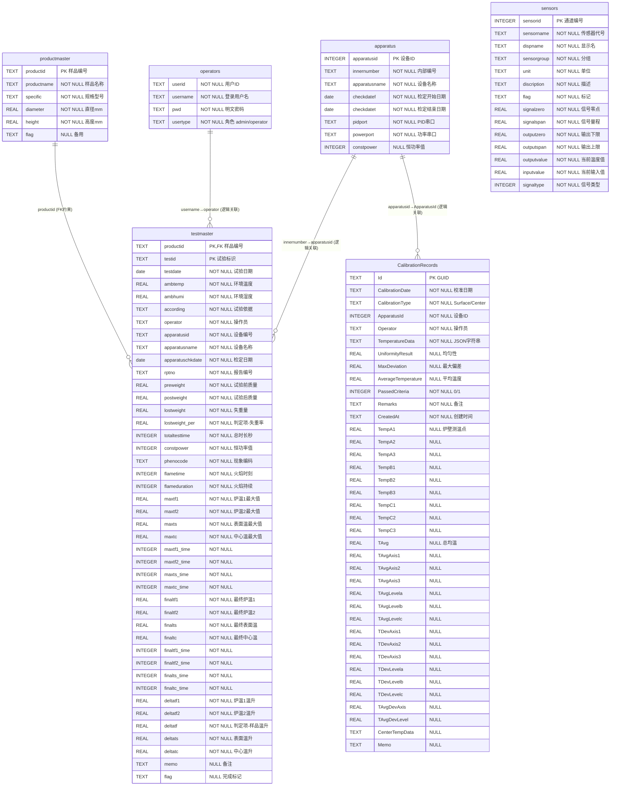

# ISO 11820 数据库 ER 图

> 在 VS Code 中按 `Ctrl+Shift+V` 预览，即可看到渲染后的 ER 图。
> 如果预览不渲染，安装插件 "Markdown Preview Mermaid Support"（bierner.markdown-mermaid）。

---

## 表关系说明

| 关系 | 类型 | 说明 |
|------|------|------|
| `productmaster` → `testmaster` | **FK 约束** | `productid` 外键，必须先创建样品才能创建试验 |
| `operators` → `testmaster` | 逻辑关联 | `operator` 字段存 username，无数据库约束 |
| `apparatus` → `testmaster` | 逻辑关联 | `apparatusid` 字段存 innernumber，无数据库约束 |
| `apparatus` → `CalibrationRecords` | 逻辑关联 | `ApparatusId` 字段存 apparatusid，无数据库约束 |
| `sensors` | 独立表 | 无外键关联，运行时动态更新 `outputvalue` |

---

## 关键注意事项

- ⚠️ `operators` 表**无主键**，登录按 `username + pwd` 查询
- ⚠️ `CalibrationRecords` 表名**大写开头**，与其他表不同
- ⚠️ `testmaster` 联合主键 `(productid, testid)`，查询/更新必须同时提供
- ⚠️ `testmaster.flag = "10000000"` 表示试验记录已保存
- ⚠️ 温度时序数据**不入库**，存独立 CSV 文件