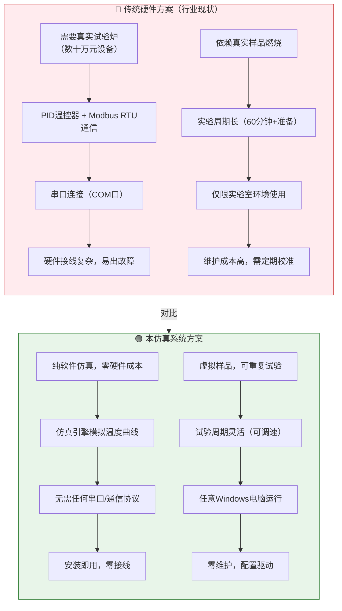
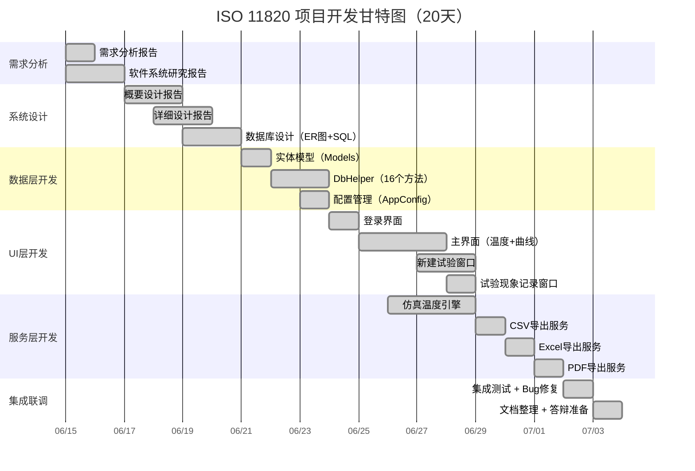
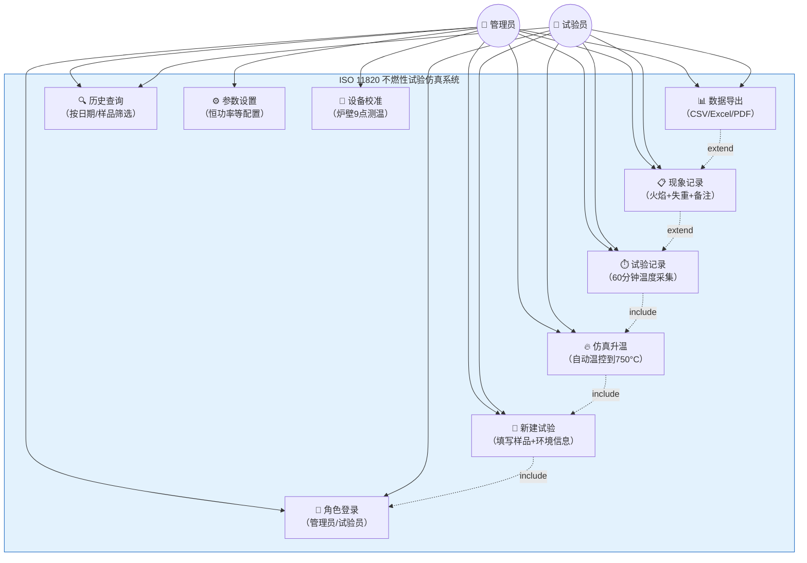
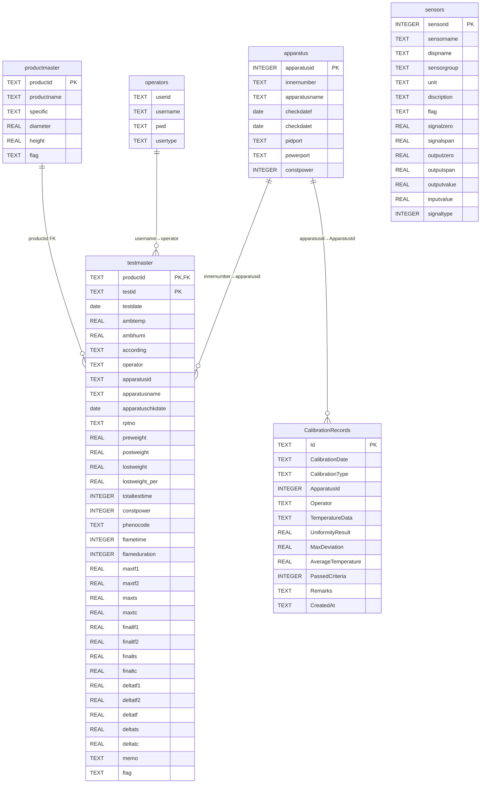
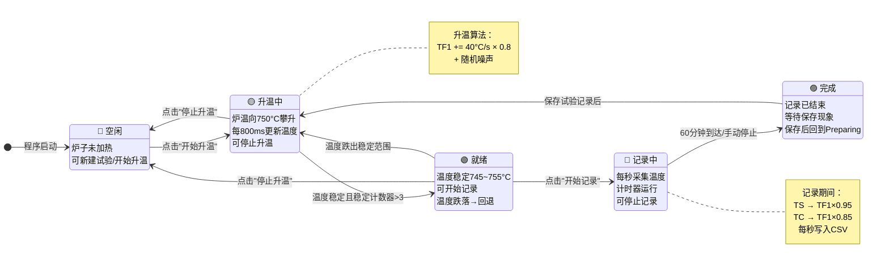

# ISO 11820 项目图表集

> 在 VS Code 中按 `Ctrl+Shift+V` 预览，需安装插件 "Markdown Preview Mermaid Support"。
> 所有图表使用 Mermaid 语法，无需额外画图软件。

---

## 1. 行业现状对比图示（第 4 页）



### 对比要点

| 维度 | 传统硬件方案 | 本仿真系统 |
|------|:-----------:|:--------:|
| 硬件成本 | 数十万元 | 0 元 |
| 通信方式 | Modbus RTU + 串口 | 无需通信 |
| 实验材料 | 真实样品（一次性） | 虚拟样品（可重复） |
| 部署环境 | 实验室 | 任意 Windows 电脑 |
| 维护成本 | 高（定期校准） | 零 |
| 教育适用性 | 低（设备昂贵） | 高（人人可用） |

---

## 2. 项目开发时间轴 / 甘特图（第 6 页）



### 团队分工

| 角色 | 成员 | 负责模块 |
|:----:|------|------|
| A（组长） | 李孟鲜 | 需求分析、软件系统研究、Core层、集成联调、打包发布 |
| B | 兰竣雯 | 概要设计、详细设计、Data层、CSV/Excel导出 |
| C | 廖紫彤 | UI插图/截图、Forms层全部界面 |
| D | 龚小倩 | 演示视频、测试、PDF导出、文件管理 |

---

## 3. UML 用例图（第 12 页）



---

## 4. BPMN 业务流程图（第 12 页）

```mermaid
flowchart TD
    Start([🚀 启动程序]) --> Login[🔐 角色登录<br/>选择角色+输入密码]
    Login --> LoginCheck{密码正确?}
    LoginCheck -->|❌ 否| LoginFailed[显示"密码错误"]
    LoginFailed --> Login
    LoginCheck -->|✅ 是| MainForm[进入主界面]

    MainForm --> NewTest[📝 新建试验<br/>填写样品信息/环境参数]
    NewTest --> CreateOK{创建成功?}
    CreateOK -->|否| NewTest
    CreateOK -->|是| StartHeat[🔥 点击"开始升温"]

    StartHeat --> Heating[升温中 Preparing<br/>炉温向750°C攀升]
    Heating --> StableCheck{温度稳定<br/>745~755°C?}
    StableCheck -->|否| Heating
    StableCheck -->|是| Ready[✅ 就绪 Ready<br/>提示可以开始记录]

    Ready --> StartRec[⏱️ 点击"开始记录"]
    StartRec --> Recording[记录中 Recording<br/>每秒采集温度数据]
    Recording --> TimeCheck{到达60分钟<br/>或手动停止?}
    TimeCheck -->|否| Recording
    TimeCheck -->|是| Complete[🏁 完成 Complete]

    Complete --> SaveRecord[📋 保存试验记录<br/>填写现象+试验后质量]
    SaveRecord --> CalcResult[计算失重率/温升]
    CalcResult --> Export[📊 导出报告<br/>CSV/Excel/PDF]
    Export --> QueryOrNew{继续操作?}
    QueryOrNew -->|新建试验| NewTest
    QueryOrNew -->|查询历史| History[🔍 记录查询]
    QueryOrNew -->|退出| End([👋 退出程序])

    style Start fill:#4caf50,color:#fff
    style End fill:#f44336,color:#fff
    style Login fill:#2196f3,color:#fff
    style MainForm fill:#2196f3,color:#fff
    style Heating fill:#ff9800,color:#fff
    style Ready fill:#4caf50,color:#fff
    style Recording fill:#ff9800,color:#fff
    style Complete fill:#9c27b0,color:#fff
```

---

## 5. 数据库 ER 图（第 14 页）✅ 已有

参见 `ER图.md`，或直接预览下方：



---

## 6. 状态机转移图（第 15 页）



### 状态转移规则表

| 当前状态 | 触发事件 | 目标状态 | 说明 |
|---------|---------|---------|------|
| Idle | 点击"开始升温" | Preparing | 仿真引擎启动 |
| Preparing | 温度稳定 + 计数器>3 | Ready | 自动判定 |
| Preparing | 点击"停止升温" | Idle | 手动停止 |
| Ready | 点击"开始记录" | Recording | 计时开始 |
| Ready | 温度跌出745~755°C | Preparing | 自动回退 |
| Ready | 点击"停止升温" | Idle | 手动停止 |
| Recording | 60分钟到达/手动停止 | Complete | 记录结束 |
| Complete | 保存试验记录 | Preparing | 保持炉温，等待下次 |
| Complete | 点击"停止升温" | Idle | 冷却到室温 |

---

## 画图工具推荐

| 工具 | 类型 | 推荐场景 | 链接 |
|------|------|------|------|
| **Mermaid**（本文档用） | 文本→图表 | 嵌入 Markdown，VS Code 直接预览 | 免费 |
| **Draw.io** | 可视化拖拽 | 复杂布局、BPMN、网络拓扑 | [app.diagrams.net](https://app.diagrams.net) |
| **PlantUML** | 文本→UML | 专业 UML 图（类图/时序图/组件图） | [plantuml.com](https://plantuml.com) |
| VS Code 插件 | 集成 | Draw.io Integration (hediet.vscode-drawio) | VS Code 市场 |

> 💡 **建议**：简单图表用 Mermaid（本文档已包含），复杂图表用 Draw.io 在线版，导出为 PNG 插入 Word 报告。